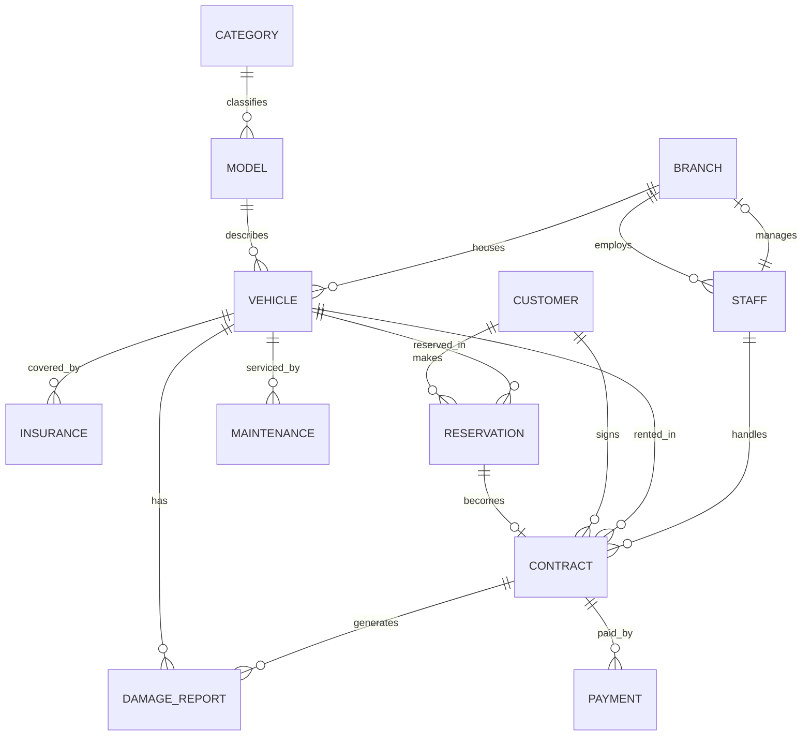

# Vehicle Rental System - Design Document

## Conceptual Scope

The system manages a multi-branch vehicle rental company. It tracks vehicle categories, vehicle models, physical vehicles, branches, staff, customers, reservations, rental contracts, payments, maintenance, insurance, damage reports, and audit logs.

## ERD Entities

| Entity | Primary Key | Purpose |
|---|---|---|
| category | category_id | Vehicle pricing and classification tier |
| model | model_id | Make, model, year, capacity, fuel, transmission |
| branch | branch_id | Rental location |
| staff | staff_id | Employees assigned to branches |
| vehicle | vehicle_id | Physical rental unit |
| insurance | insurance_id | Policy coverage per vehicle |
| customer | customer_id | Registered renter |
| reservation | reservation_id | Pre-booking record |
| contract | contract_id | Signed rental agreement |
| payment | payment_id | Money received for a contract |
| maintenance | maintenance_id | Service jobs |
| damage_report | damage_id | Damage found before or after rental |
| audit_log | log_id | Trigger-maintained history |

## Relationship Summary

| From | Relationship | To | Cardinality |
|---|---|---|---|
| category | classifies | model | 1:N |
| model | describes | vehicle | 1:N |
| branch | houses | vehicle | 1:N |
| branch | employs | staff | 1:N |
| staff | manages | branch | 1:1 optional |
| vehicle | has | insurance | 1:N |
| customer | makes | reservation | 1:N |
| vehicle | reserved in | reservation | 1:N |
| reservation | becomes | contract | 1:1 optional |
| customer | signs | contract | 1:N |
| vehicle | rented through | contract | 1:N |
| staff | handles | contract | 1:N |
| contract | receives | payment | 1:N |
| vehicle | receives | maintenance | 1:N |
| vehicle | has | damage_report | 1:N |
| contract | can generate | damage_report | 1:N optional |

## EERD Features

| EERD Concept | Implementation |
|---|---|
| Specialization | staff.role specializes staff into Manager, Agent, Mechanic, and Cleaner. It is total and disjoint because every staff member has exactly one role enforced by CHECK. |
| Generalization | category generalizes rental classes such as Economy, Sedan, SUV, Luxury, and Van. |
| Aggregation | contract aggregates customer, vehicle, reservation, staff, pickup branch, return branch, dates, and pricing into the signed rental transaction. |

## Normalization Proof

### First Normal Form

All table columns store atomic values. Repeating groups are separated into child tables, such as multiple payments per contract, multiple maintenance jobs per vehicle, and multiple insurance policies per vehicle.

### Second Normal Form

Every table uses a single-column UUID primary key. Non-key attributes depend on the whole key. Model details are separated from physical vehicle details, so make/model/year are not repeated for every vehicle.

### Third Normal Form

There are no transitive dependencies among non-key columns. Branch city belongs to branch, not contract. Category base rate belongs to category, not vehicle. Contract agreed_daily_rate is stored as a historical snapshot because rental price can change later.

### BCNF

Every determinant is a candidate key or belongs to a relationship controlled by a key. UNIQUE constraints on customer.driver_license_no, customer.email, insurance.policy_number, vehicle.license_plate, and vehicle.vin prevent hidden determinants from violating BCNF.

## Mermaid ERD Source

Paste this into a Mermaid renderer or documentation tool and export as PNG/PDF.

